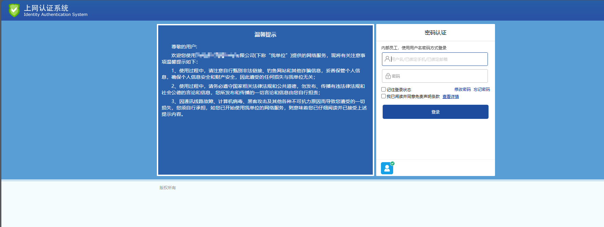

### 1、每次重启电脑或者每天都会重定向到网络认证页面

```
http://1.1.1.3/ac_portal/disclaimer/pc.html
```

### 

### 2、依赖安装

```
pip install requests -i https://pypi.doubanio.com/simple
```


### 3、使用python脚本自动化认证网络

```python
# -*- coding: utf-8 -*-
# @Time    : 2022/1/13 22:01
# @Author  : CYX
# @Email   : im.cyx@foxmail.com
# @File    : login_network.py
# @Software: PyCharm

import msvcrt
import requests
import time
import json
import os

# 使cmd能够正确输出颜色
if os.name == "nt":
    os.system("")

# 切换工作目录到系统临时文件区域
os.chdir(os.getenv('TMP'))
# 文件名称
file_name = "user_account.json"
# 如果不存在临时文件，根据输入新建临时文件保存账号密码
if not os.path.exists(file_name):
    # 输入账号密码
    account = input("Please input your account: ")
    password = input("Please input your password: ")
    res = {
        'account': account,
        'password': password
    }
    print(res)
    # 写入json
    with open(file_name, "w+") as fp:
        fp.write(json.dumps(res))
# 如果存在，说明之前已经写入
else:
    # 读取账号密码
    with open(file_name, "r")as fp:
        res = json.loads(fp.read())
        account = res['account']
        password = res['password']
headers = {
        "X-Requested-With": "XMLHttpRequest",
        "User-Agent": "Mozilla/5.0 (Windows NT 10.0; Win64; x64) AppleWebKit/537.36 (KHTML, like Gecko) Chrome/97.0.4692.71 Safari/537.36",
        "Content-Type": "application/x-www-form-urlencoded; charset=UTF-8",     # 必须指定，否则报404
    }
# RC4加密算法
def do_encrypt_rc4(src:str, passwd:str)->str:
    i, j, a, b, c = 0, 0, 0, 0, 0
    key, sbox = [], []
    plen = len(passwd)
    size = len(src)
    output = ""

    # 初始化密钥key和状态向量sbox
    for i in range(256):
        key.append(ord(passwd[i % plen]))
        sbox.append(i)
    # 状态向量打乱
    for i in range(256):
        j = (j + sbox[i] + key[i]) % 256
        temp = sbox[i]
        sbox[i] = sbox[j]
        sbox[j] = temp
    # 秘钥流的生成与加密
    for i in range(size):
        # 子密钥生成
        a = (a + 1) % 256
        b = (b + sbox[a]) % 256
        temp = sbox[a]
        sbox[a] = sbox[b]
        sbox[b] = temp
        c = (sbox[a] + sbox[b]) % 256
        # 明文字节由子密钥异或加密
        temp = ord(src[i]) ^ sbox[c]
        # 密文字节转换成hex，格式对齐修正（取最后两位，若为一位（[0x0，0xF]），则改成[00, 0F]）
        temp = str(hex(temp))[-2:]
        temp = temp.replace('x', '0')
        # 输出
        output += temp
    return output
def auth_go():
    # 请求网址
    url = "http://1.1.1.3/ac_portal/login.php"
    # 请求头
    # headers = {
    #     "X-Requested-With": "XMLHttpRequest",
    #     "User-Agent": "Mozilla/5.0 (Windows NT 10.0; Win64; x64) AppleWebKit/537.36 (KHTML, like Gecko) Chrome/97.0.4692.71 Safari/537.36",
    #     "Content-Type": "application/x-www-form-urlencoded; charset=UTF-8",     # 必须指定，否则报404
    # }
    # 时间戳（提取ms单位）
    tag = int(time.time()*1000)
    # 利用RC4加密算法获取基于时间戳的密码
    pwd = do_encrypt_rc4(password, str(tag))
    # 账号、密码、时间戳写入payload报文
    payload = f"opr=pwdLogin&userName={account}&pwd={pwd}&auth_tag={tag}&rememberPwd=1"

    while True:
        try:
            # 提交登录

            res = requests.post(url, data=payload, headers=headers)
            print(res)
            # 输出登录结果
            if res.status_code == 200 and res.text.find("true")>0:
                print(f"\033[7;32;47m{res.content.decode('utf-8')} \033[0m")
            else:
                print(f"\033[7;31;47m{res.content.decode('utf-8')} \033[0m")
                print("\033[7;31;47m", "Login fail! Make sure input true account info!", "\033[0m")
                os.remove(file_name)
                print("\033[7;36;47m", "Already clear account file.\n Restart EXE and input again.", "\033[0m")
            #print("Press any key to exit...")
            # 等待退出
            #if ord(msvcrt.getch()):
            break
        # 如果请求出错，大概率网络未连
        except Exception as err:
            # 提示
            print("\033[7;31;47m","Login Error！\tMaybe you need link wifi first?" ,"\033[0m")
            # 输出err
            print("\033[7;33;40m", err,"\033[0m")
            # # 按“R”再次执行脚本，按其它按键退出
            # print("Press 'R' to restart, or break...")
            # if ord(msvcrt.getch()) != 114:
            #     break
            time.sleep(10)
            break


def ping_check(ip_or_host):
    cmd = "ping %s -n 1 " % ip_or_host
    a = os.popen(cmd)
    b = a.read().strip()
    #print(b)
    if "100% 丢失" in b:
        return False
    return True


def main():
    while True:
        # res = requests.get("https://baidu.com/", headers=headers)
        # if res.status_code != 200:
        #     auth_go()
        res = ping_check("1.2.4.8")
        time.sleep(5)
        if not res:
            print("检测到网络断开，尝试认证网络！")
            auth_go()
        continue
main()
```

### 4、安装pyinstaller库，打包成exe程序，生产auth_net.exe

```
pip install pyinstaller
pyinstaller -F aaaa.py
#生成dist/aaaa.exe
```

首次运行需要输入用户名密码进行认证，因此需要手动打开程序输入

后续脚本将账户信息保存到配置文件不需要再认证（除非删除Windows临时目录内的配置文件C:\Users\wsq\AppData\Local\Temp\user_account.json）

### 5、创建Windows任务计划程序


### 6、程序运行结果，每次开机自启动


